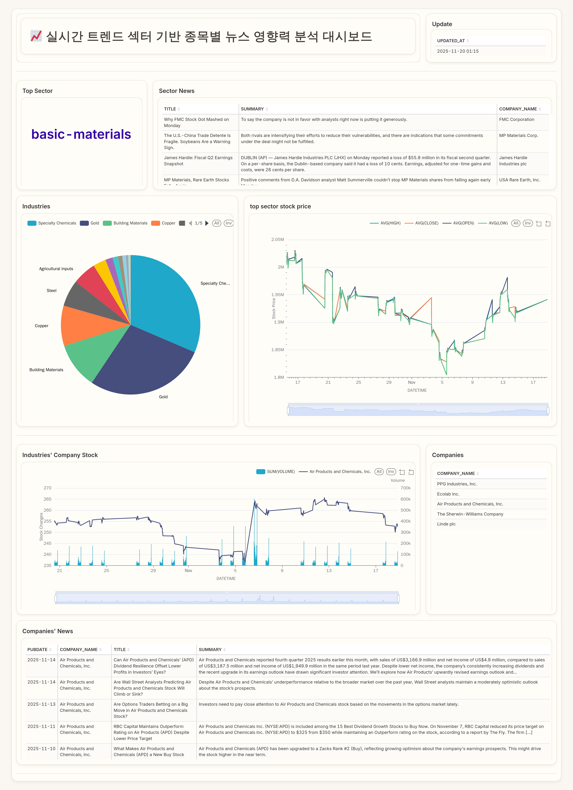
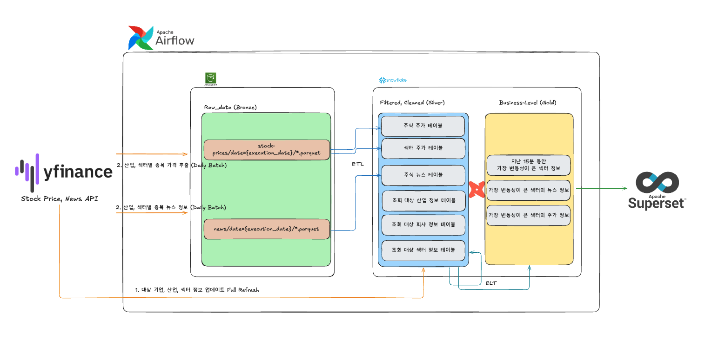

# 실시간 트렌드 섹터 기반 종목별 뉴스 영향력 분석 대시보드

## 프로젝트 소개
> 특정 섹터(변동성이 큰, 급등, 급락)에 대해 어떤 뉴스, 어떤 이슈가 있는지 확인할 수 있도록
> Airflow 기반의 파이프라인을 개발한 프로젝트입니다.

### Dashboard



## Data Flow


1. **Data Fetching (Source -> S3 Data Lake)**
   - yfinance API를 통해 섹터, 산업, 회사 정보를 가져와 Snowflake의 테이블을 갱신
   - DAG가 매시간 실행되어 yfinance API에서 모든 회사의 최신 뉴스를 수집
   - DAG가 15분 간격으로 실행되어 yfinance API에서 개별 종목 및 섹터별 주가를 수집
2. **Data Loading (S3 Lake → Snowflake Warehouse)**
   - S3에 저장된 주식 데이터를 클리닝 및 변환 후 Snowflake에 적재
   - 뉴스 데이터는 Snowflake에 `EXTERNAL TABLE`로 생성
   - 
3. **Data Transformation (dbt)**
   - 저장된 Snowflake의 Row Data를 기반으로 다양한 분석용 테이블 생성  
        _가장 변동이 큰 섹터 및 섹터의 산업 정보, 해당 섹터의 뉴스 정보_
## 🛠️ 기술 스택

### Orchestration

<div>
    
</div>

### Storage

<div>
    
    
</div>

### ETL/ELT

<div>
    
    
    
</div>

### 시각화

<div>
    
</div>

### 인프라

<div>
    
    
    
    
    
</div>

## Getting Started

> docker-compose 기반의 Airflow 환경을 설정합니다.

- **Airflow 실행**

```bash
git clone https://github.com/de7-2TL/pipeline.git
cd pipeline/scripts

sh docker-compose-up.sh
```

- **Local 환경 구축**

```bash
uv sync
```

### Airflow Variables & Connections

- **connections:**  
    snowflake_conn: Snowflake connection  
    aws_conn : Amazon Web Service connection  

- **pools:**  
    sector_upload_pool : 기본 slot은 3개. 사양에 따라 조정

- **variables:**  
    AWS_BUCKET: bucket 이름

### Scripts

- docker-compose-up.sh : Docker Compose를 통해 Airflow 환경을 실행합니다.
- sync-pip-from-reqs.sh : requirements.txt 파일에 명시된 패키지를 Docker 컨테이너에 동기화합니다.

## Project Structure

```
.
├── ansible # Docker Container에 패키지 설치를 위한 Ansible 플레이북
├── scripts # Env 관련 실행 스크립트
├── src # Airflow Home Directory
│   ├── Dockerfile
│   ├── dags
│   │   └── dbt # DBT Home Directory
│   ├── docker-compose.yaml
│   ├── plugins
│   │   ├── hooks # Custom Hook
│   │   ├── operators # Custom Operator
│   │   └── utils # 유틸리티 함수
│   ├── requirements-base.txt # Airflow 기본 패키지
│   └── requirements.txt # 추가 패키지
├── tests # Pytest 기반의 테스트 코드
└── uv.lock
```

### Code Conventions

> Based on ~/ruff.toml

- DAG: 동사_*_dag.py (예: extract_user_data_dag.py)  
  _DBT DAG는 dbt_*_dag.py (예: dbt_transform_dag.py) #DBT를 동사로 간주합니다_
- DAG ID: `file_name`에서 subfix(_dag) 제거

## 🧑‍💻 팀원 소개 & Roles

|  |  |  |  |
|:-----------------------------------------------------------------------------------------:|:-----------------------------------------------------------------------------------------:|:-----------------------------------------------------------------------------------------:|:------------------------------------------------------------------------------------------:|
|                           [김민국](https://github.com/minguk-cucu)                           |                             [박제현](https://github.com/JehyunP)                             |                            [정성길](https://github.com/seon99il)                             |                             [천준규](https://github.com/done0173)                             |

### 📑 주요 담당 업무

#### **김민국**

> ETL DAG 작성 및 스케쥴링

- 마스터 데이터 적재를 위한 일간 DAG 작성
- Airflow 스케쥴링

#### **박제현**

> DBT(ELT) 구축 및 대시보드 제작

- S3 To Snowflake DAG 개발
- DBT를 활용하여 DW 내부에서 Raw → Stage → Analytics ELT 구현
- Superset 대시보드 제작

#### **정성길**

> S3 적재 DAG 구현 및 프로젝트 개발 환경 구축

- Airflow 뉴스 정보 저장
  - Meta 데이터를 활용하여 중복된 뉴스 정보 필터링
  - 뉴스 게시일 기반 파티셔닝 적용
- Docker Compose 기반 Airflow, DBT 개발 환경 구축

#### **천준규**

> DAG 개발 및 보고자료 제작

- 섹터별 스톡 데이터 S3 적재 DAG 개발
- 기업별 스톡 데이터 S3 적재 DAG 개발
- 보고자료 제작
